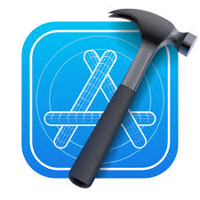

## Hi there 👋

<!--suppress HtmlDeprecatedAttribute -->

 

<!-- OLD github-readme-stats

-->

<!-- 

 -->

<!-- activity graph heroku-app start -->
<!-- 

    
    

 -->
<!-- activity graph heroku-app end -->

 
 

<!-- 

    

 -->
